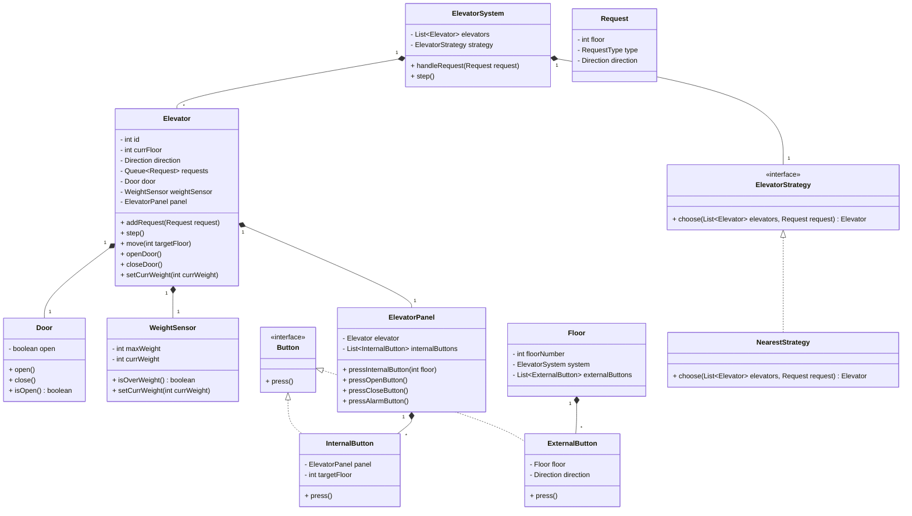

# Elevator

This repository contains a scalable, production-quality low-level design (LLD) for an Elevator System implemented in Java.

## Class Diagram

```mermaid
classDiagram
    class ElevatorSystem {
        - List~Elevator~ elevators
        - ElevatorStrategy strategy
        + handleRequest(Request request)
        + step()
    }

    class Elevator {
        - int id
        - int currFloor
        - Direction direction
        - Queue~Request~ requests
        - Door door
        - WeightSensor weightSensor
        - ElevatorPanel panel
        + addRequest(Request request)
        + step()
        + move(int targetFloor)
        + openDoor()
        + closeDoor()
        + setCurrWeight(int currWeight)
    }

    class Door {
        - boolean open
        + open()
        + close()
        + isOpen() boolean
    }

    class WeightSensor {
        - int maxWeight
        - int currWeight
        + isOverWeight() boolean
        + setCurrWeight(int currWeight)
    }

    class Button {
        <<interface>>
        + press()
    }

    class InternalButton {
        - ElevatorPanel panel
        - int targetFloor
        + press()
    }

    class ExternalButton {
        - Floor floor
        - Direction direction
        + press()
    }

    class Floor {
        - int floorNumber
        - ElevatorSystem system
        - List~ExternalButton~ externalButtons
    }

    class ElevatorPanel {
        - Elevator elevator
        - List~InternalButton~ internalButtons
        + pressInternalButton(int floor)
        + pressOpenButton()
        + pressCloseButton()
        + pressAlarmButton()
    }

    class Request {
        - int floor
        - RequestType type
        - Direction direction
    }

    class ElevatorStrategy {
        <<interface>>
        + choose(List~Elevator~ elevators, Request request) Elevator
    }

    class NearestStrategy {
        + choose(List~Elevator~ elevators, Request request) Elevator
    }

    Button <|.. InternalButton
    Button <|.. ExternalButton
    ElevatorSystem "1" *-- "*" Elevator
    Elevator "1" *-- "1" Door
    Elevator "1" *-- "1" WeightSensor
    Elevator "1" *-- "1" ElevatorPanel
    ElevatorPanel "1" *-- "*" InternalButton
    Floor "1" *-- "*" ExternalButton
    ElevatorSystem "1" *-- "1" ElevatorStrategy
    ElevatorStrategy <|.. NearestStrategy
```
